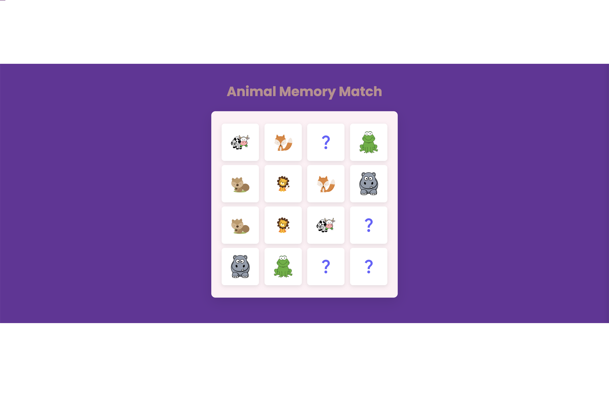

# 🧩 Animal Memory Match

A simple memory match game using animal-themed cards.

## Description

This project is a web-based memory match game where players need to find pairs of animal-themed cards. The game presents a grid of facedown cards, and the player flips them over to reveal the animal images. The objective is to find all matching pairs by remembering the positions of the cards.

## Preview

## Technologies Used

- HTML
- CSS
- JavaScript

## Instructions

1. Open the `index.html` file in a web browser.
2. Click on any facedown card to reveal the image.
3. Click on a second card to reveal its image.
4. If the images match, the cards remain face up. If not, the cards flip back facedown.
5. Continue flipping pairs of cards until all matches are found.

